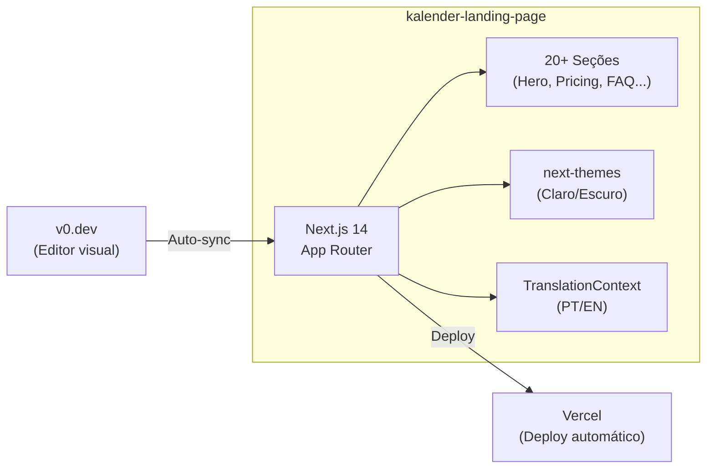

# kalender-landing-page

Landing page institucional da plataforma Kalender — apresentação do produto, preços, FAQ e páginas legais para o mercado brasileiro de salões, barbearias e clínicas.

## Visão Geral

Site estático construído com Next.js 14 e Tailwind CSS, com deploy automático na Vercel via sincronização com [v0.dev](https://v0.dev). Suporte a temas claro/escuro, SEO otimizado e multilíngue (PT-BR/EN).

---

## Diagrama de Arquitetura



---

## Tecnologias

- **Next.js 14.2** — Framework React com App Router
- **React 18** — Biblioteca de UI
- **TypeScript 5** — Tipagem estática
- **Tailwind CSS 3.4** — Utilitários CSS
- **Radix UI** — Componentes acessíveis
- **Vercel** — Hosting e deploy automático
- **v0.dev** — Editor visual (sincronizado)

---

## Dependências Principais

| Pacote | Versão | Função |
|--------|--------|--------|
| `next` | ^14.2.35 | Framework React SSR/SSG |
| `react` | ^18 | Biblioteca de UI |
| `tailwindcss` | ^3.4.4 | Utilitários CSS |
| `@radix-ui/react-*` | latest | Componentes acessíveis |
| `lucide-react` | ^0.454.0 | Ícones |
| `next-themes` | ^0.4.6 | Tema claro/escuro |
| `react-fast-marquee` | ^1.6.5 | Animação de marquee |
| `@vercel/analytics` | ^1.5.0 | Analytics Vercel |
| `@vercel/speed-insights` | ^1.3.1 | Web Vitals |
| `class-variance-authority` | ^0.7.1 | Variantes de componentes |
| `tailwind-merge` | ^2.5.5 | Merge de classes Tailwind |
| `tailwindcss-animate` | ^1.0.7 | Animações |

---

## Páginas

| Rota | Descrição |
|------|-----------|
| `/` | Landing page principal (hero, features, pricing, FAQ) |
| `/login` | Página de login |
| `/signup` | Cadastro |
| `/contact` | Contato |
| `/pricing` | Preços |
| `/terms` | Termos de uso (EN) |
| `/terms/termos` | Termos de uso (PT) |
| `/privacy` | Política de privacidade (EN) |
| `/privacidade` | Política de privacidade (PT) |

---

## Configuração

### Variáveis de Ambiente

O projeto usa variáveis padrão do Next.js. Não há `.env.example` — as configurações são mínimas:

```env
# Variáveis opcionais
NEXT_PUBLIC_APP_URL=https://app.kalender.com.br
```

### next.config.mjs

```javascript
{
  trailingSlash: false
}
```

---

## Como Executar

```bash
# Pré-requisitos: Node.js 18+, npm ou pnpm

# Instalar dependências
npm install

# Desenvolvimento
npm run dev

# Build de produção
npm run build
npm run start

# Lint
npm run lint
```

---

## Deploy

O deploy é automático via Vercel:

1. Edite o projeto em [v0.dev](https://v0.dev/chat/projects/cYzYuVI7eQ2)
2. Mudanças são automaticamente pushed para este repositório
3. Vercel detecta o push e faz deploy automaticamente

**URL de produção:** [vercel.com/jmaciel33s-projects/v0-kalender-app](https://vercel.com/jmaciel33s-projects/v0-kalender-app)

---

## Estrutura do Projeto

```
kalender-landing-page/
├── app/
│   ├── page.tsx                    # Landing page principal
│   ├── layout.tsx                  # Root layout (SEO, JSON-LD, Analytics)
│   ├── globals.css                 # Design tokens e animações
│   ├── sitemap.ts                  # Sitemap XML
│   ├── login/page.tsx              # Login
│   ├── signup/page.tsx             # Cadastro
│   ├── contact/page.tsx            # Contato
│   ├── terms/page.tsx              # Termos (EN)
│   ├── terms/termos/page.tsx       # Termos (PT)
│   ├── privacy/page.tsx            # Privacidade (EN)
│   └── privacidade/page.tsx        # Privacidade (PT)
├── components/
│   ├── sections/                   # 20+ seções da landing page
│   │   ├── hero.tsx
│   │   ├── features.tsx
│   │   ├── pricing.tsx
│   │   ├── faq.tsx
│   │   ├── ai-section.tsx
│   │   ├── ai-whatsapp.tsx
│   │   ├── social-proof.tsx
│   │   ├── how-it-works.tsx
│   │   ├── problem.tsx
│   │   ├── solution.tsx
│   │   ├── cta.tsx
│   │   └── ...
│   ├── mockups/                    # Mockups interativos do produto
│   ├── layout/navbar.tsx           # Navegação
│   ├── ui/                         # Componentes base (Shadcn)
│   └── theme-provider.tsx          # Tema claro/escuro
├── contexts/
│   └── translation-context.tsx     # i18n context (PT/EN)
├── hooks/
│   └── use-toast.ts                # Hook de toast
├── lib/
│   ├── translations.ts             # Dados de tradução
│   └── utils.ts                    # cn() utility
├── design-system/                  # Documentação do design system
├── public/
│   ├── images/                     # Assets
│   └── robots.txt                  # Robots.txt
├── components.json                 # Config Shadcn/ui
├── next.config.mjs
├── tailwind.config.ts
├── tsconfig.json
└── package.json
```
